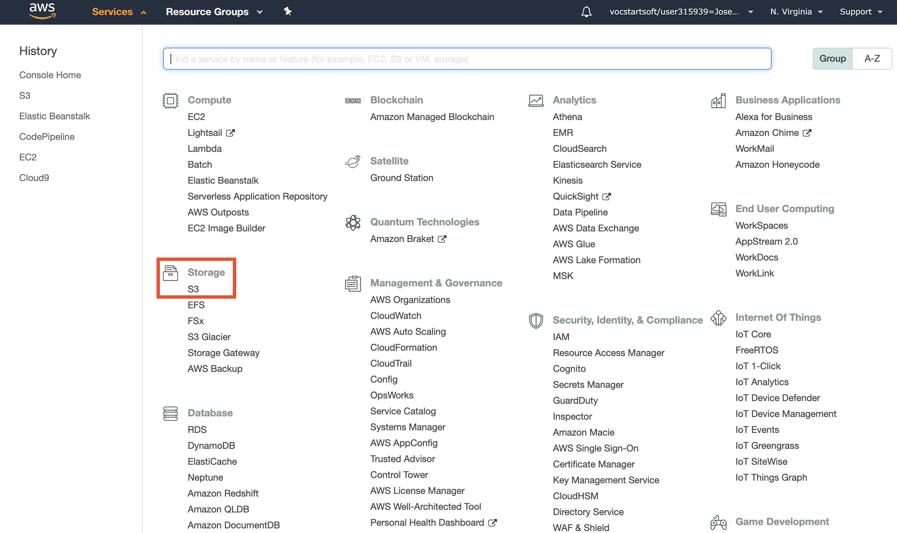

# Lab 4 - AWS EBS

Em este lab sobre **Simple Storage Service (S3)** aprenderemos alguns conceitos importantes do armazenamento de objetos:
 - Criação de *buckets*
 - Criação de objetos
   * Controle de permissões de acesso
 - Hospedagem de sites estáticos

## Criação do *bucket*
 
1. Accessar o serviço **S3**:
   

2. Criar um novo *bucket*:
   

3. Escolher um nome para o *bucket*:
   
   
4. Em esta aba podem ser configuradas algumas opções do *bucket*, como versionamento, *logging*, etc.:
   

5. Habilitar accesso público no *bucket*:
   

6. Confirmar a criação do *bucket*:
   

7. Conferir que o *bucket* foi criado:
   

## Criação do objeto

8. Fazer o *upload* de uma imagem qualquer:
   

9. Habilitar accesso público no objeto:
   

10. Seleccionar o *tier* `Standard`:
   

11. Confirmar a criação do objeto:
   

12. Conferir que o objeto foi criado:
   

13. Na descrição do objeto, podemos obter a url do mesmo:

    |          | bucket-name |                   | objeto        |
    |----------|-------------|-------------------|-------------- |
    | https:// | fiap-mba    | .s3.amazonaws.com | sicmundus.jpg |

       

14. Accessar a imagem pela URL do objeto:
       

## Hospedagem de sites estáticos
    
15. Alterar a configuração do bucket para permitir o armazenamento de sites estáticos:
       

16. Introducir o nome do arquivo `html` principal:
       

17. Fazer *upload* do arquivo [`index.html`](/mob/cloud/files/index.html) (ou de qualquer outro arquivo `html`) com permissão de accesso público, como descrito na [criação de objeto](#criacao-do-objeto)

17. A URL no modo armazenamento de sites estáticos apresenta um novo formato:

    |          | bucket-name |            | region    |               |
    |----------|-------------|------------|---------- | --------------|
    | https:// | fiap-mba    | s3-website | us-east-1 | amazonaws.com |

18. Acessar o site pela nova URL do *bucket*:
       
