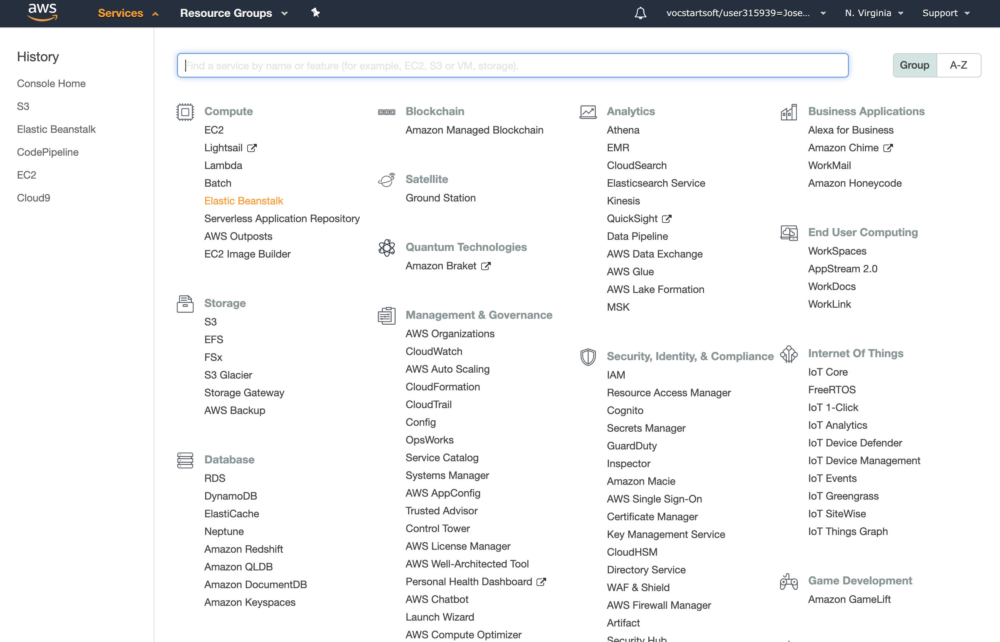

# Lab 5 - AWS Elastic Beanstalk

Em este lab sobre **Elastic Beanstalk (EB)** aprenderemos alguns conceitos importantes da camada de plataforma da AWS:
 - *Deploy* de aplicações
 - Plataformas/entornos de execução disponíveis
 - *Logging*
 - Monitoramento

## Deploy da aplicação
 
1. Acessar o serviço **Elastic Beanstalk**:
   

2. Criar um novo *environment*:
   

3. A aplicação é um serviço web:
   
   
4. Configurar o nome da apliação:
   

5. Escolher o entorno de execução:
   
   
6. Fazer o *upload* da aplicação. O arquivo comprimido deve conter os [seguintes arquivos](lab05-paas-eb):
 - [**`application.py`**](lab05-paas-eb/application.py): Um serviço web escrito em Python que usa a biblioteca [Flask](https://flask.palletsprojects.com/en/1.1.x/).
 - [**`requirements.txt`**](lab05-paas-eb/requirements.txt): As dependências da aplicação. Podem ser instaladas usando `pip`, o gestor de dependências do Python.
 
   

7. Após uns minutos, conferir o estado da aplicação:
   

8. Accessar a URL da aplicação:
   

## *Logging* e monitoramento

9. Se for necessário fazer *troubleshooting* da aplicação, fazer *download* dos logs:
   

10. Para monitorar a aplicação:
   

