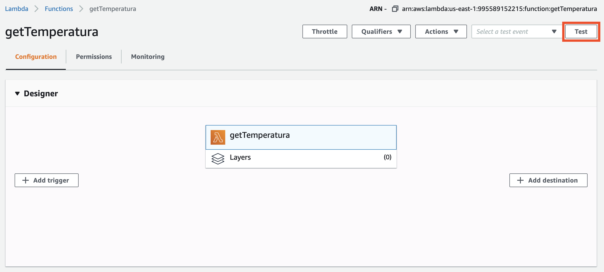
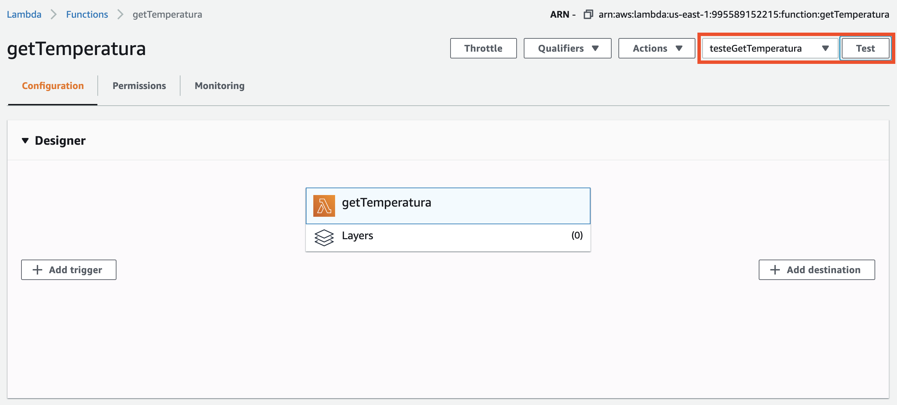

# Lab 13 - Amazon Lambda

Em este lab sobre **Lambda** aprenderemos alguns conceitos do modulo de Function as a Service (FaaS) / *serverless* da plataforma da AWS:
 - Criação de funções Lambda
 - Teste de funções 
 - Criação de triggers (via API Gateway)
 
## Pre-reqs

- A seguinte tabela, com nome `Atmosfera` criada no DynamoDB:
    

 ## Configuração do serviço

1. Acessar o serviço **Lambda**:
    

2. Criar uma nova função:
    
   
3. Criar uma primera função getTemperatura com Python como *runtime*:
    

4. Configurar o seguinte código para a função:
    ```python
    import json
    import boto3
    def lambda_handler(event, context):
       # TODO implement
       dynamodb = boto3.resource('dynamodb')
       tableTemperatures = dynamodb.Table('Atmosfera')
       response = tableTemperatures.scan()
       return {
          'statusCode': 200,
          'body': response['Items'][0]['temperatura']
       }
    ```
    O código lee o valor temperatura da tabela `Atmosfera` do DynamoDB.
    
    
 5. Fazer *deploy* do código:
     

 6. Vamos testar o código:
      

 7. Criamos um evento de testes. A entrada do evento (o arquivo `json`) é indeferente em este caso específico, pois a API não está lendo entrada:
      

 8. Criamos um evento de testes. A entrada do evento (o arquivo `json`) é indeferente em este caso específico, pois a API não está lendo entrada:
      

 9. Executar o evento de testes recém criado `testeGetTemperatura`:
       

 10. O teste deve falhar, pois a função não tem permissão para acessar o DynamoDB:
       


